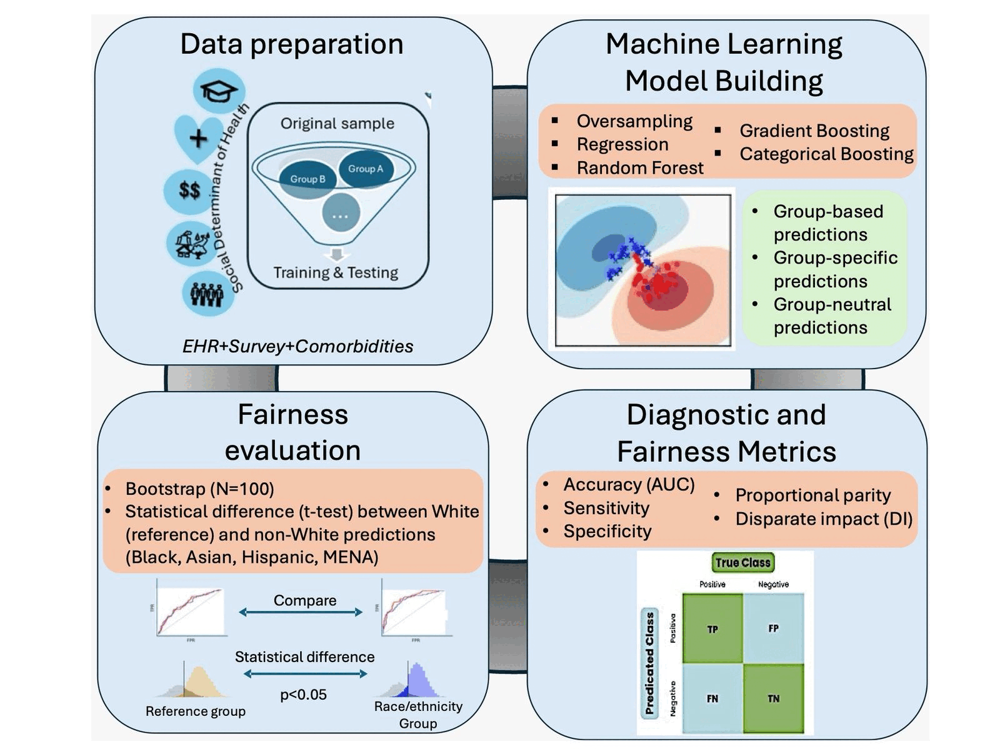

# Are AI Models Fair in Predicting Asthma Hospitalizations? 🤔💡

As AI continues to shape healthcare, we must ask: Are predictive models equally accurate for all racial and ethnic groups? Our latest research, using data from the All of Us Research Program, dives into this crucial question, focusing on asthma hospitalizations.

# 📊 Key Findings:
✅ Predictive models for Black, Hispanic/Latino (HL), and Middle Eastern & North African (MENA) individuals were slightly less accurate in estimating asthma length of stay (LoS) and were more likely to miss true prolonged hospitalizations.
✅ For asthma readmission, models for these same groups were less accurate but more likely to incorrectly predict readmission, leading to potential overuse of resources.
✅ After applying fairness techniques, we saw some improvements in bias metrics, particularly for Black and HL individuals in LoS predictions and for Asian, HL, and MENA groups in readmission predictions.

#  Why This Matters:
Algorithmic bias in healthcare can reinforce existing disparities, leading to unequal care and treatment decisions. Our study underscores the need for rigorous validation to ensure AI-driven healthcare tools are fair, accurate, and equitable for all populations.

🔬 Want to learn more? Check the code and paper 👇

#AIinHealthcare #HealthEquity #FairnessInAI #AsthmaCare #AlgorithmicBias